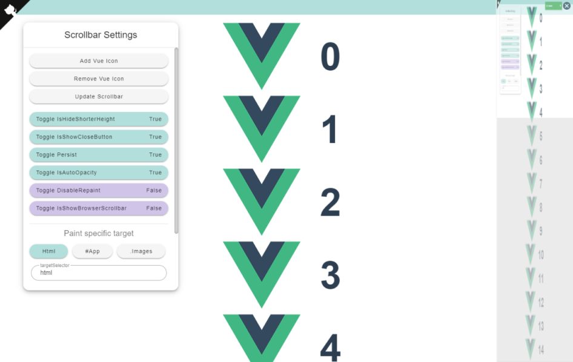

# [Page Preview Scrollbar](https://github.com/Jchou24/page-preview-scrollbar)

A scrollbar with current page preview for Vue2.

[Demo](https://jchou24.github.io/Demos/PagePreviewScrollbar/index.html)

[Demo Video](https://jchou24.github.io/Demos/PagePreviewScrollbar/Demo(2021-01-01).mp4)



# Installation

```bash
npm install -D jctk-page-preview-scrollbar
npm install @vue/composition-api
``` 

# Usage

```js
// main.js
import 'jctk-page-preview-scrollbar'
import 'jctk-page-preview-scrollbar/dist/jctk-page-preview-scrollbar.css'
import VueCompositionAPI from '@vue/composition-api'

Vue.use(VueCompositionAPI)
```

In your component.
```html
<template>
    <PagePreviewScrollbar />
</template>
```

## Why Composition API

Since some mechanism of vue & composition API.

The library deveoped with composition API seems can not run individually without it.

The detail is descriped [here](https://stackoverflow.com/questions/64864935/runtime-error-integrating-a-component-lib-that-uses-vue-composition-api-you-m).

# Configurations

Property | Type | Default | Description
--- | --- | --- | ---
isHideShorterHeight | Boolean | true | Automatically hide the scrollbar when screen is short.
isShowCloseButton | Boolean | true | Display the buton which can close scrollbar.
isAutoOpacity | Boolean | true | Make the scrollbar transparent.
isResizeAutoRepaint | Boolean | false | Auto repain when sceen height or width resizes.
persist | Boolean | true | Force the scrollbar always appeared/disappeared.
zIndex | Number | 100 | css z-index.
disableRepaint | Boolean | false | Set true to avoid performance decreased by repainting.
targetSelector | String | "html" | The element used to preview.
elementToRmoveSelectors | Array<String> | [] | The elements should not appear in scrollbar.
throttle | Number | 25 |
debounceRepaint | Number | 1000 |

# Events

Event | Description
--- | ---
@repainted | Triggered when scrollbar repainted the preview.
@active    | Triggered when scrollbar is active.
@inactive  | Triggered when scrollbar is inactive.

# Methods

Method | Description
--- | ---
Reset | Force the scrollbar repaint the preview.
ResetScroller | Force the scrollbar reset the screen position.
